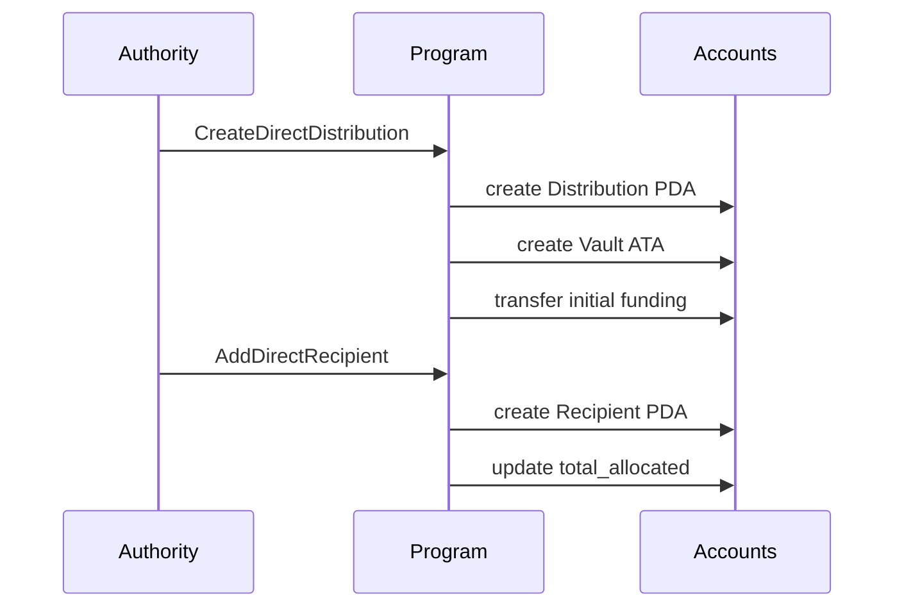
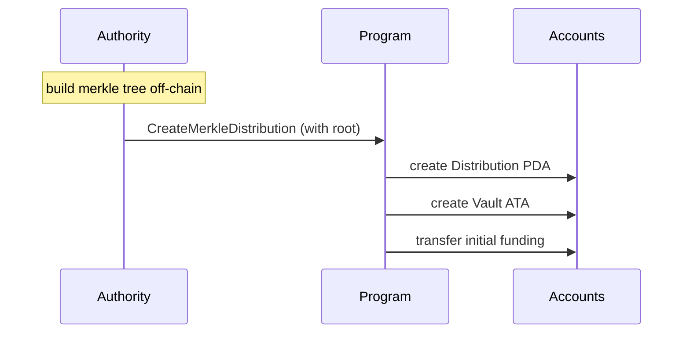
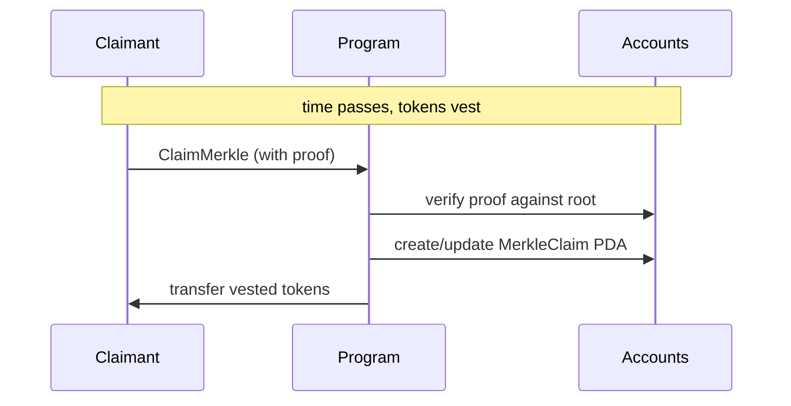
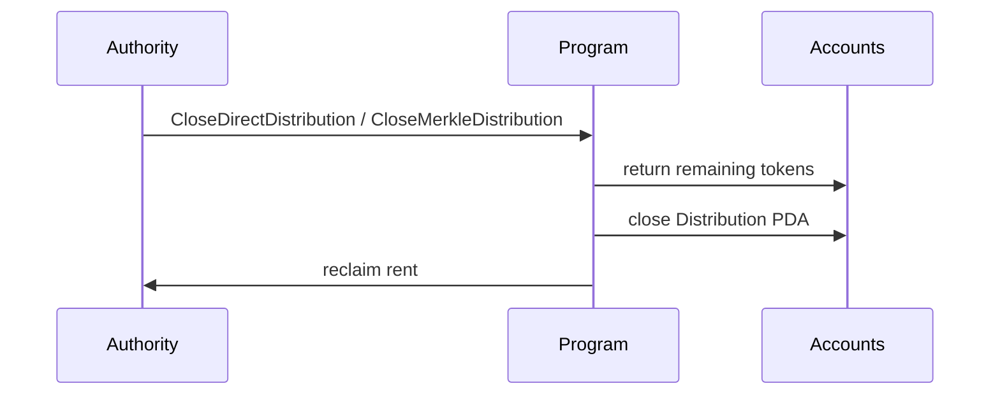

# Rewards Program

[](LICENSE)
[](https://github.com/solana-program/pinocchio)
[](https://solana.com)

> **SECURITY NOTICE**: This program has not been audited. Use at your own risk. Not recommended for production use with real funds without a thorough security review.

## Program ID

```
REWArDioXgQJ2fZKkfu9LCLjQfRwYWVVfsvcsR5hoXi
```

## Deployments

| Network | Program ID |
| ------- | ---------- |

## Overview

A token vesting program for Solana that enables authorities to create distributions with configurable vesting schedules. Recipients can claim tokens as they vest over time according to their individual schedule.

## Key Features

- **Two distribution types** - Direct (on-chain recipient accounts) and Merkle (off-chain tree, on-chain root)
- **Configurable vesting schedules** - Immediate, Linear, Cliff, and CliffLinear
- **Per-recipient configuration** - Each recipient has their own vesting schedule within a distribution
- **Token-2022 support** - Works with both SPL Token and Token-2022 mints

## When to Use What

### Distribution Type

|                  | Direct                                          | Merkle                                                                   |
| ---------------- | ----------------------------------------------- | ------------------------------------------------------------------------ |
| **How it works** | Creates an on-chain account per recipient       | Stores a single merkle root on-chain; recipients provide proofs to claim |
| **Upfront cost** | Authority pays rent for every recipient account | No per-recipient accounts until someone claims                           |
| **Scalability**  | Practical up to low thousands of recipients     | Scales to millions with constant on-chain storage                        |
| **Mutability**   | Recipients can be added after creation          | Recipient set is fixed at creation                                       |
| **Best for**     | Small, dynamic distributions                    | Large, fixed distributions                                               |

### Vesting Schedule

| Schedule        | Behavior                                                                                                                                          |
| --------------- | ------------------------------------------------------------------------------------------------------------------------------------------------- |
| **Immediate**   | All tokens are claimable right away                                                                                                               |
| **Linear**      | Tokens unlock proportionally between `start_ts` and `end_ts`                                                                                      |
| **Cliff**       | Nothing unlocks until `cliff_ts`, then everything unlocks at once                                                                                 |
| **CliffLinear** | Nothing unlocks until `cliff_ts`, then linear vesting from `start_ts` to `end_ts` (tokens accrued before the cliff become claimable at the cliff) |

## Account Types

| Account            | PDA Seeds                                         | Description                                   |
| ------------------ | ------------------------------------------------- | --------------------------------------------- |
| DirectDistribution | `["direct_distribution", mint, authority, seeds]` | Distribution config (authority, mint, totals) |
| DirectRecipient    | `["direct_recipient", distribution, recipient]`   | Recipient allocation and vesting schedule     |
| MerkleDistribution | `["merkle_distribution", mint, authority, seeds]` | Distribution config with merkle root          |
| MerkleClaim        | `["merkle_claim", distribution, claimant]`        | Tracks claimed amount per claimant            |

## Workflow

### Direct Distribution




### Merkle Distribution





### Closing



## Documentation

- [CU Benchmarks](docs/CU_BENCHMARKS.md) - Compute unit usage per instruction

## Local Development

### Prerequisites

- Rust
- Node.js (see `.nvmrc`)
- pnpm (see `package.json` `packageManager`)
- Solana CLI

All can be conveniently installed via the [Solana CLI Quick Install](https://solana.com/docs/intro/installation).

### Build & Test

```bash
# Install dependencies
just install

# Full build (IDL + clients + program)
just build

# Run integration tests
just integration-test

# Run integration tests with CU tracking
just integration-test --with-cu

# Format and lint
just fmt
```

## Tech Stack

- **[Pinocchio](https://github.com/anza-xyz/pinocchio)** - Lightweight `no_std` Solana framework
- **[Codama](https://github.com/codama-idl)** - IDL-driven client generation
- **[LiteSVM](https://github.com/LiteSVM/litesvm)** - Fast local testing

---

Built and maintained by the [Solana Foundation](https://solana.org/).

Licensed under MIT. See [LICENSE](LICENSE) for details.

## Support

- [**Solana StackExchange**](https://solana.stackexchange.com/) - tag `rewards-program`
- [**Open an Issue**](https://github.com/solana-program/rewards/issues/new)
