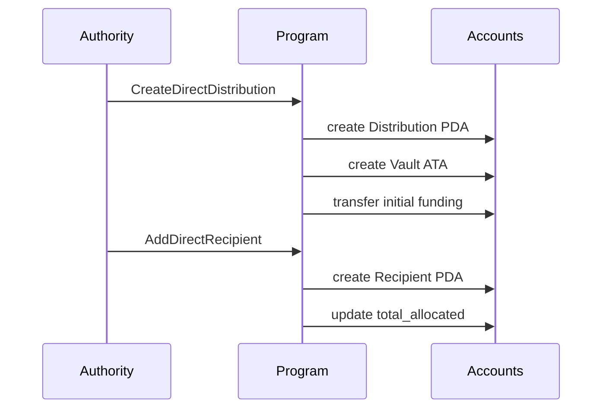
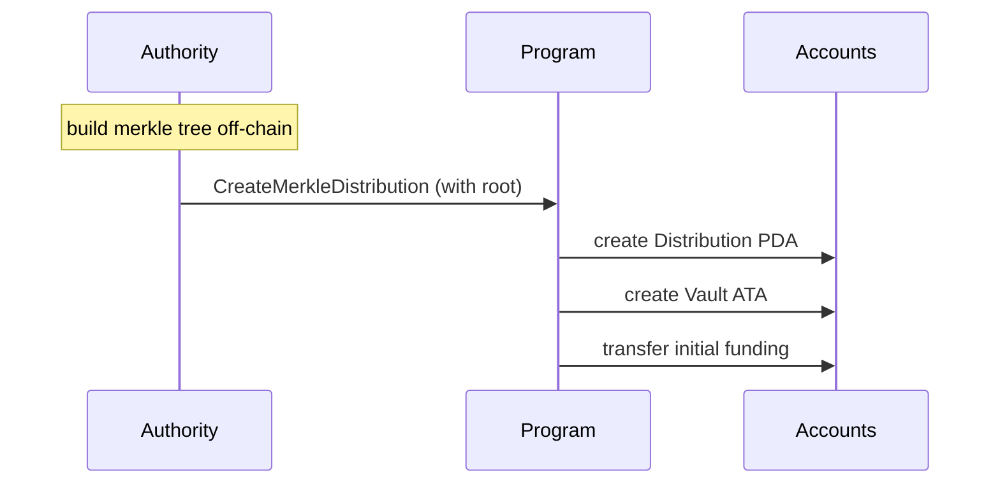
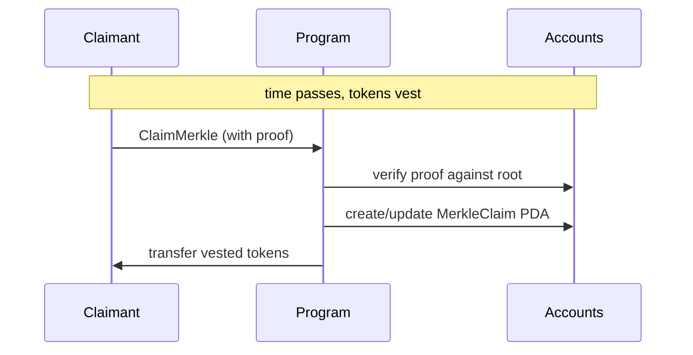
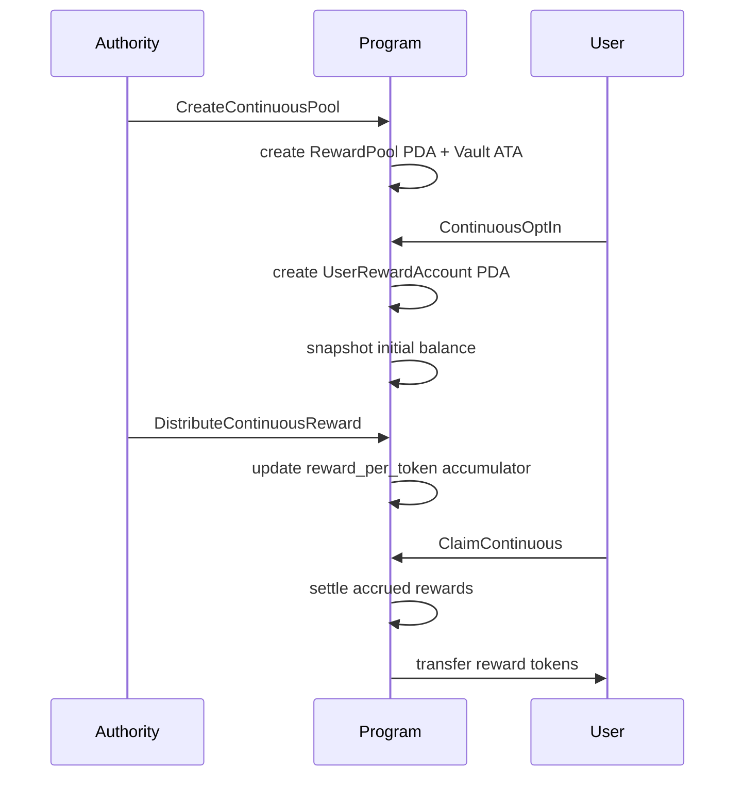
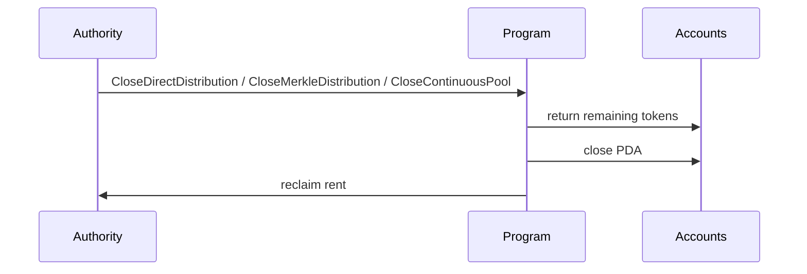

# Rewards Program

[](LICENSE)
[](https://github.com/solana-program/pinocchio)
[](https://solana.com)

> **SECURITY NOTICE**: This program has not been audited. Use at your own risk. Not recommended for production use with real funds without a thorough security review.

## Program ID

```
3bwhqHWmDDh3gYZ8gFpSFBwwtyiSTfhRnWZo34nSjohX
```

## Deployments

| Network | Program ID |
| ------- | ---------- |

## Overview

A token rewards program for Solana that supports three distribution models: direct allocations with vesting, merkle-proof-based claims, and continuous reward pools with proportional distribution.

## Key Features

- **Three distribution types** - Direct (on-chain recipient accounts), Merkle (off-chain tree, on-chain root), and Continuous (proportional reward pools)
- **Configurable vesting schedules** - Immediate, Linear, Cliff, and CliffLinear (Direct and Merkle)
- **Continuous reward pools** - Users earn rewards proportional to their held balance over time
- **Revocation support** - Authority can revoke recipients across all distribution types (NonVested or Full mode)
- **Token-2022 support** - Works with both SPL Token and Token-2022 mints

## When to Use What

### Distribution Type

|                  | Direct                                          | Merkle                                                                   | Continuous                                                         |
| ---------------- | ----------------------------------------------- | ------------------------------------------------------------------------ | ------------------------------------------------------------------ |
| **How it works** | Creates an on-chain account per recipient       | Stores a single merkle root on-chain; recipients provide proofs to claim | Users opt in; rewards distributed proportional to held balance     |
| **Upfront cost** | Authority pays rent for every recipient account | No per-recipient accounts until someone claims                           | Users pay rent for their own reward account on opt-in              |
| **Scalability**  | Practical up to low thousands of recipients     | Scales to millions with constant on-chain storage                        | Scales to any number of opted-in users                             |
| **Mutability**   | Recipients can be added after creation          | Recipient set is fixed at creation                                       | Users opt in/out freely; authority distributes rewards at any time |
| **Best for**     | Small, dynamic distributions                    | Large, fixed distributions                                               | Ongoing reward programs (staking, liquidity mining)                |

### Vesting Schedule (Direct & Merkle only)

| Schedule        | Behavior                                                                                                                                          |
| --------------- | ------------------------------------------------------------------------------------------------------------------------------------------------- |
| **Immediate**   | All tokens are claimable right away                                                                                                               |
| **Linear**      | Tokens unlock proportionally between `start_ts` and `end_ts`                                                                                      |
| **Cliff**       | Nothing unlocks until `cliff_ts`, then everything unlocks at once                                                                                 |
| **CliffLinear** | Nothing unlocks until `cliff_ts`, then linear vesting from `start_ts` to `end_ts` (tokens accrued before the cliff become claimable at the cliff) |

### Revocation Modes

| Mode          | Behavior                                                                     |
| ------------- | ---------------------------------------------------------------------------- |
| **NonVested** | Vested/accrued tokens are transferred to the user; unvested tokens are freed |
| **Full**      | All tokens (vested and unvested) are returned to the authority               |

Revocation is opt-in per distribution via the `revocable` bitmask field. A `Revocation` marker PDA is created per user to permanently block future claims or opt-ins.

## Account Types

| Account            | PDA Seeds                                                     | Description                                   |
| ------------------ | ------------------------------------------------------------- | --------------------------------------------- |
| DirectDistribution | `["direct_distribution", mint, authority, seed]`              | Distribution config (authority, mint, totals) |
| DirectRecipient    | `["direct_recipient", distribution, recipient]`               | Recipient allocation and vesting schedule     |
| MerkleDistribution | `["merkle_distribution", mint, authority, seed]`              | Distribution config with merkle root          |
| MerkleClaim        | `["merkle_claim", distribution, claimant]`                    | Tracks claimed amount per claimant            |
| RewardPool         | `["reward_pool", reward_mint, tracked_mint, authority, seed]` | Continuous pool config and reward accumulator |
| UserRewardAccount  | `["user_reward", reward_pool, user]`                          | Tracks user participation and accrued rewards |
| Revocation         | `["revocation", parent, user]`                                | Marker PDA blocking revoked users (all types) |

## Instructions

### Direct Distribution

| #   | Instruction              | Description                                         |
| --- | ------------------------ | --------------------------------------------------- |
| 0   | CreateDirectDistribution | Create distribution, fund vault                     |
| 1   | AddDirectRecipient       | Add recipient with vesting schedule                 |
| 2   | ClaimDirect              | Recipient claims vested tokens                      |
| 9   | RevokeDirectRecipient    | Authority revokes a recipient                       |
| 4   | CloseDirectRecipient     | Recipient reclaims rent after full vest             |
| 3   | CloseDirectDistribution  | Authority closes distribution, reclaims tokens/rent |

### Merkle Distribution

| #   | Instruction              | Description                                         |
| --- | ------------------------ | --------------------------------------------------- |
| 5   | CreateMerkleDistribution | Create distribution with merkle root, fund vault    |
| 6   | ClaimMerkle              | Claimant proves allocation and claims vested tokens |
| 10  | RevokeMerkleClaim        | Authority revokes a claimant with merkle proof      |
| 7   | CloseMerkleClaim         | Claimant reclaims rent after distribution closed    |
| 8   | CloseMerkleDistribution  | Authority closes distribution, reclaims tokens/rent |

### Continuous Reward Pool

| #   | Instruction                | Description                                              |
| --- | -------------------------- | -------------------------------------------------------- |
| 11  | CreateContinuousPool       | Create pool with tracked/reward mints and balance source |
| 12  | ContinuousOptIn            | User opts in; initial balance snapshot taken             |
| 14  | DistributeContinuousReward | Authority deposits rewards; accumulator updated          |
| 16  | SyncContinuousBalance      | Permissionless: sync user's on-chain token balance       |
| 17  | SetContinuousBalance       | Authority sets user balance (AuthoritySet mode only)     |
| 15  | ClaimContinuous            | User claims accrued rewards                              |
| 19  | RevokeContinuousUser       | Authority revokes user from pool                         |
| 13  | ContinuousOptOut           | User opts out and claims remaining rewards               |
| 18  | CloseContinuousPool        | Authority closes pool, reclaims remaining tokens         |

## Workflow

### Direct Distribution




### Merkle Distribution





### Continuous Reward Pool



### Closing



## Documentation

- [Direct Distribution](program/src/instructions/direct/README.md) - On-chain recipient accounts with vesting
- [Merkle Distribution](program/src/instructions/merkle/README.md) - Off-chain tree, on-chain root verification
- [Continuous Reward Pool](program/src/instructions/continuous/README.md) - Proportional balance-based rewards
- [CU Benchmarks](docs/CU_BENCHMARKS.md) - Compute unit usage per instruction

## Local Development

### Prerequisites

- Rust
- Node.js (see `.nvmrc`)
- pnpm (see `package.json` `packageManager`)
- Solana CLI

All can be conveniently installed via the [Solana CLI Quick Install](https://solana.com/docs/intro/installation).

### Build & Test

```bash
# Install dependencies
just install

# Full build (IDL + clients + program)
just build

# Run integration tests
just integration-test

# Run integration tests with CU tracking
just integration-test --with-cu

# Format and lint
just fmt
```

## Tech Stack

- **[Pinocchio](https://github.com/anza-xyz/pinocchio)** - Lightweight `no_std` Solana framework
- **[Codama](https://github.com/codama-idl)** - IDL-driven client generation
- **[LiteSVM](https://github.com/LiteSVM/litesvm)** - Fast local testing

---

Built and maintained by the [Solana Foundation](https://solana.org/).

Licensed under MIT. See [LICENSE](LICENSE) for details.

## Support

- [**Solana StackExchange**](https://solana.stackexchange.com/) - tag `rewards-program`
- [**Open an Issue**](https://github.com/solana-program/rewards/issues/new)
