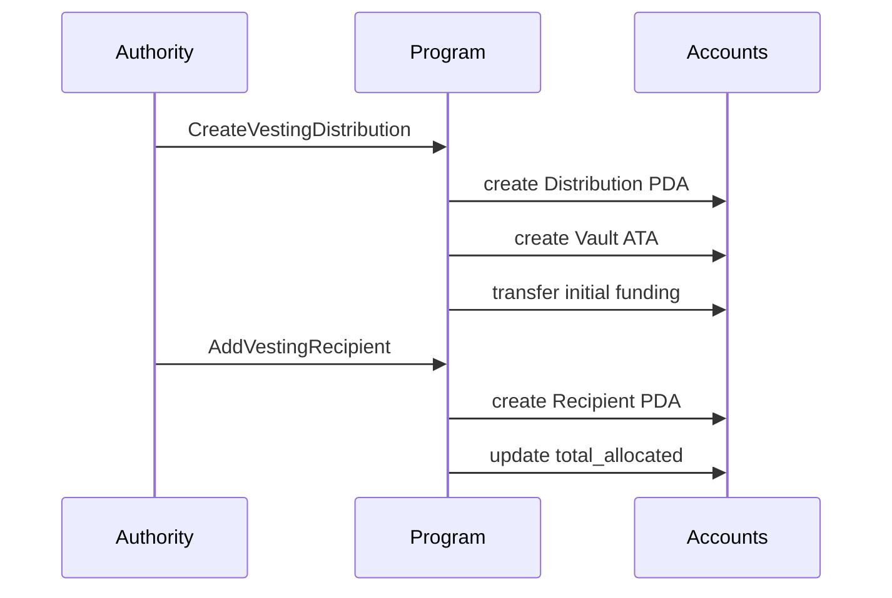
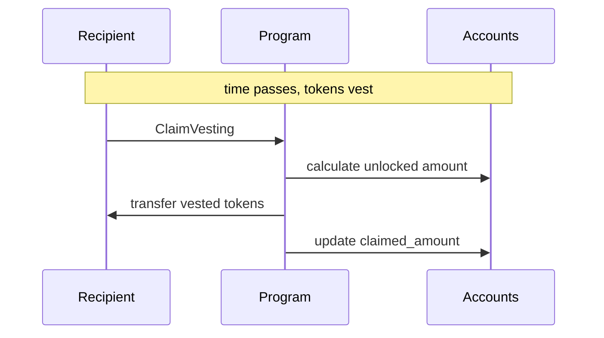
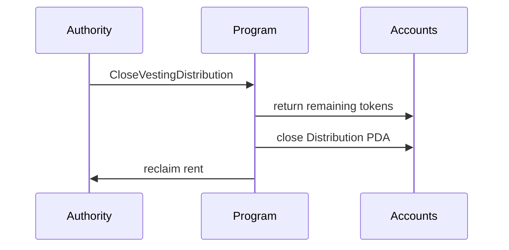

# Rewards Program

[](LICENSE)
[](https://github.com/solana-program/pinocchio)
[](https://solana.com)

> **SECURITY NOTICE**: This program has not been audited. Use at your own risk. Not recommended for production use with real funds without a thorough security review.

## Program ID

```
7kw4iaikc9qTaFGcWx4wDiCXkkLddTb65HV8xH7KbHyc
```

## Deployments

| Network | Program ID |
| ------- | ---------- |

## Overview

A token vesting program for Solana that enables authorities to create distributions with configurable vesting schedules. Recipients can claim tokens as they vest over time according to their individual schedule.

## Key Features

- **Linear vesting schedules** - Tokens unlock proportionally over time between start and end timestamps
- **Per-recipient configuration** - Each recipient has their own vesting schedule within a distribution
- **Token-2022 support** - Works with both SPL Token and Token-2022 mints
- **Extension blocking** - Rejects mints with PermanentDelegate, NonTransferable, or Pausable extensions

## Account Types

| Account             | PDA Seeds                                          | Description                                   |
| ------------------- | -------------------------------------------------- | --------------------------------------------- |
| VestingDistribution | `["vesting_distribution", mint, authority, seeds]` | Distribution config (authority, mint, totals) |
| VestingRecipient    | `["vesting_recipient", distribution, recipient]`   | Recipient allocation and vesting schedule     |

## Workflow







## Documentation

- [CU Benchmarks](docs/CU_BENCHMARKS.md) - Compute unit usage per instruction

## Local Development

### Prerequisites

- Rust
- Node.js (see `.nvmrc`)
- pnpm (see `package.json` `packageManager`)
- Solana CLI

All can be conveniently installed via the [Solana CLI Quick Install](https://solana.com/docs/intro/installation).

### Build & Test

```bash
# Install dependencies
just install

# Full build (IDL + clients + program)
just build

# Run integration tests
just integration-test

# Run integration tests with CU tracking
just integration-test --with-cu

# Format and lint
just fmt
```

## Tech Stack

- **[Pinocchio](https://github.com/anza-xyz/pinocchio)** - Lightweight `no_std` Solana framework
- **[Codama](https://github.com/codama-idl)** - IDL-driven client generation
- **[LiteSVM](https://github.com/LiteSVM/litesvm)** - Fast local testing

---

Built and maintained by the [Solana Foundation](https://solana.org/).

Licensed under MIT. See [LICENSE](LICENSE) for details.

## Support

- [**Solana StackExchange**](https://solana.stackexchange.com/) - tag `rewards-program`
- [**Open an Issue**](https://github.com/solana-program/rewards/issues/new)
