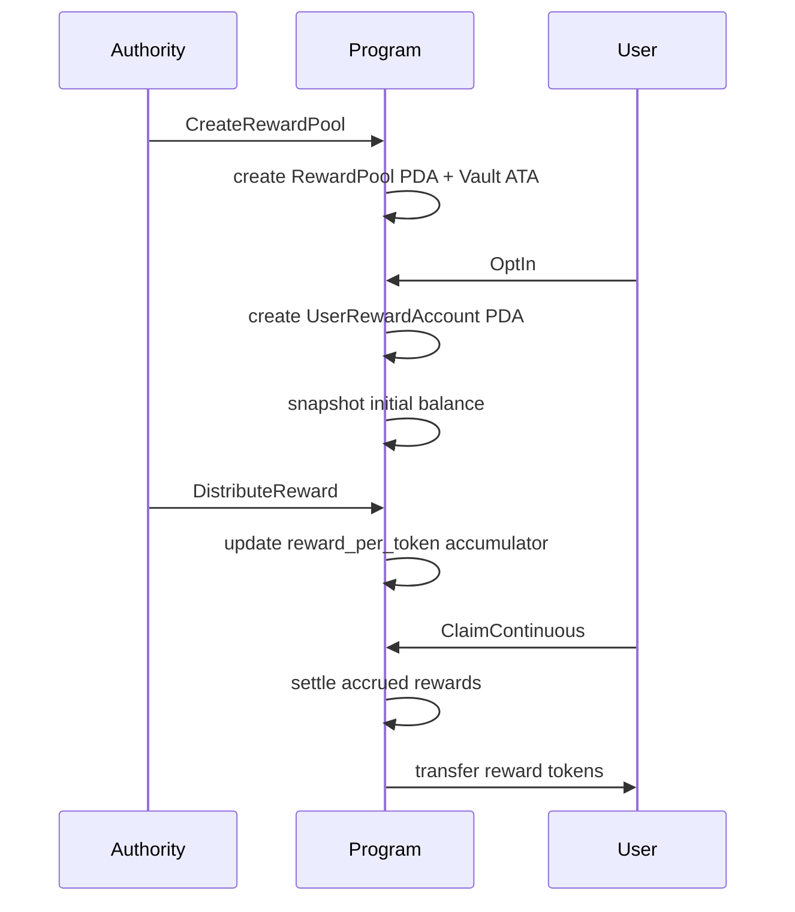

# Continuous Reward Pool Guide

Continuous reward pools are best for ongoing programs where rewards are
distributed proportionally to tracked balances over time.

## Mental Model

- Authority creates a `RewardPool` for tracked and reward mints.
- Users opt in, creating a `UserRewardAccount`.
- Authority distributes rewards, updating pool accumulator state.
- Users claim accrued rewards or opt out.

## Balance Modes

- `OnChain`: user tracked token account balance is read and synced.
- `AuthoritySet`: authority sets user balances directly with `SetBalance`.

## Primary Accounts

- `RewardPool` PDA: pool config, totals, reward-per-token accumulator
- `reward_vault` ATA: reward token custody
- `UserRewardAccount` PDA: user snapshot and accrued rewards
- `Revocation` PDA: optional revocation marker per user

## Instruction Lifecycle

1. `CreateRewardPool`
2. `OptIn` (user path)
3. `DistributeReward` (authority path, repeatable)
4. Optional: `SyncBalance` or `SetBalance` (by balance mode)
5. `ClaimContinuous` (user path)
6. Optional: `RevokeUser`
7. `OptOut` (user close path)
8. `CloseRewardPool` (authority close path)

## Workflow Diagram

## Relevant Program Modules

- Instructions: `program/src/instructions/continuous/`
- State: `program/src/state/reward_pool.rs`, `program/src/state/user_reward_account.rs`
- Balance helpers: `program/src/utils/balance_source.rs`

## Suggested Test Entry Points

- `tests/integration-tests/src/test_opt_in.rs`
- `tests/integration-tests/src/test_distribute_reward.rs`
- `tests/integration-tests/src/test_claim_continuous.rs`
- `tests/integration-tests/src/test_continuous_lifecycle.rs`
