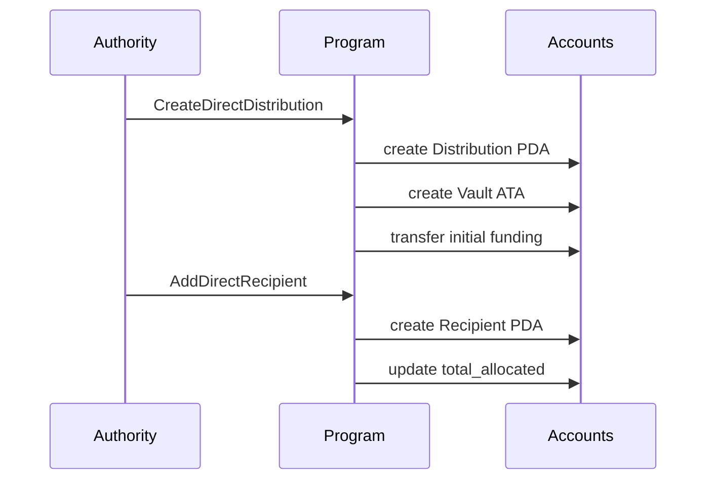
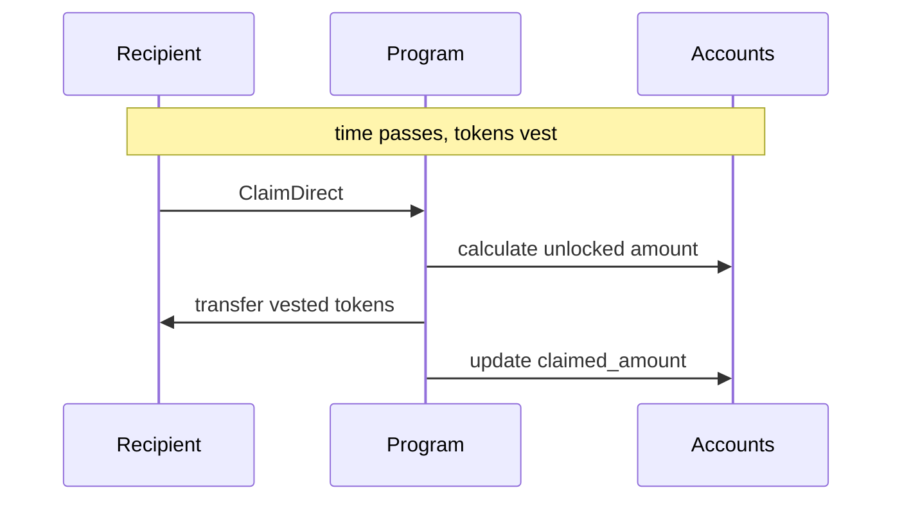

# Direct Distribution Guide

Direct distributions are best for small-to-medium recipient sets where the
authority may need to add recipients over time.

## Mental Model

- Authority creates a `DirectDistribution` and funds the vault.
- Authority creates one `DirectRecipient` account per recipient.
- Recipient claims vested tokens over time.
- Authority can revoke recipients (if enabled) and close the distribution.

## Primary Accounts

- `DirectDistribution` PDA: distribution configuration and aggregate totals
- `distribution_vault` ATA: reward token custody
- `DirectRecipient` PDA: recipient allocation and claimed amount
- `Revocation` PDA: optional revocation marker per recipient

## Instruction Lifecycle

1. `CreateDirectDistribution`
2. `AddDirectRecipient` (repeatable)
3. `ClaimDirect` (recipient path)
4. Optional: `RevokeDirectRecipient`
5. `CloseDirectRecipient` (recipient rent reclaim path)
6. `CloseDirectDistribution` (authority close path)

## Workflow Diagram

## Relevant Program Modules

- Instructions: `program/src/instructions/direct/`
- State: `program/src/state/direct_distribution.rs`, `program/src/state/direct_recipient.rs`
- Revocation: `program/src/state/revocation.rs`

## Suggested Test Entry Points

- `tests/integration-tests/src/test_create_direct_distribution.rs`
- `tests/integration-tests/src/test_add_direct_recipient.rs`
- `tests/integration-tests/src/test_claim_direct.rs`
- `tests/integration-tests/src/test_revoke_direct_recipient.rs`
