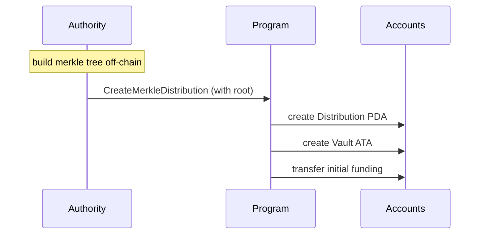
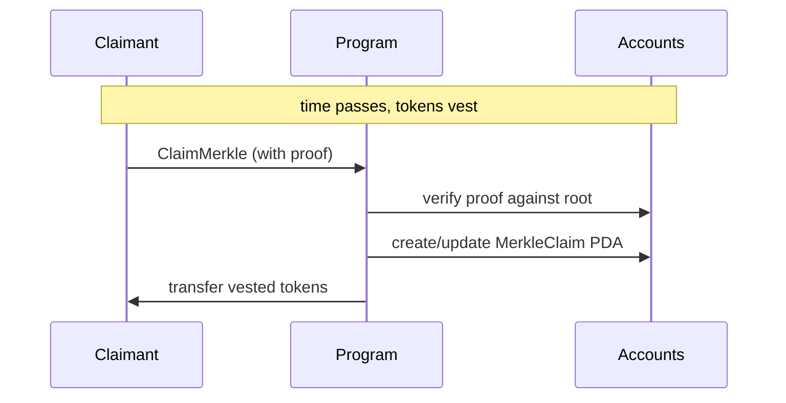

# Merkle Distribution Guide

Merkle distributions are best for large fixed recipient sets where allocations
are computed off-chain and proven on-chain during claims.

## Mental Model

- Authority builds a Merkle tree off-chain.
- Authority creates a `MerkleDistribution` with the Merkle root and funds vault.
- Claimants provide allocation + proof when calling `ClaimMerkle`.
- Authority can revoke a claimant with proof (if enabled) and close distribution.

## Primary Accounts

- `MerkleDistribution` PDA: root, vesting config, totals
- `distribution_vault` ATA: reward token custody
- `MerkleClaim` PDA: claimed amount tracking per claimant
- `Revocation` PDA: optional revocation marker per claimant

## Instruction Lifecycle

1. `CreateMerkleDistribution`
2. `ClaimMerkle` (claimant path)
3. Optional: `RevokeMerkleClaim`
4. `CloseMerkleClaim` (claimant rent reclaim path)
5. `CloseMerkleDistribution` (authority close path)

## Workflow Diagram

## Relevant Program Modules

- Instructions: `program/src/instructions/merkle/`
- State: `program/src/state/merkle_distribution.rs`, `program/src/state/merkle_claim.rs`
- Revocation: `program/src/state/revocation.rs`

## Suggested Test Entry Points

- `tests/integration-tests/src/test_create_merkle_distribution.rs`
- `tests/integration-tests/src/test_claim_merkle.rs`
- `tests/integration-tests/src/test_revoke_merkle_claim.rs`
- `tests/integration-tests/src/test_close_merkle_distribution.rs`
